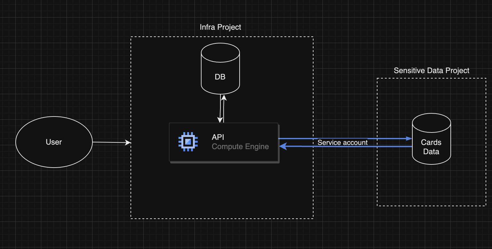

## Workflow
User --> API --> Handler --> Database Handler -> Database

## Encryption

- A good read: [Practical Cryptography in Go](https://leanpub.com/gocrypto/read)
- The current encryption process begins with a passphrase. The passphrase, along with a salt, is used to derive key using [PBKDF2 (Password Based Key Derivation Function)](https://en.wikipedia.org/wiki/PBKDF2) that follows NIST specifications of 128 bits salt size with 210,000 iterations using SHA-512.
- The key derived from above method is used along with a nonce in AES-256 cipher with Galois-Counter mode to ensure security with performance. 
- Finally, the salt, and the nonce are prepended to the ciphertext. The final result is a byte slice containing salt, nonce, and ciphertext in that order.
- Decryption process follows similar pattern: derive salt, nonce and ciphertext. Use those values to obtain plaintext.

## Next steps:
- Deployment of the API
- Improve performance. /all API takes 7 seconds for 15 cards. Setup concurrency.
- Better way for in-memory storage of sensitive information. Check this library: https://github.com/awnumar/memguard
- Implemetation of HTTPS
- Map all data to users
	- Keep one user until we work on user management
- Key management for encryption (Much later)

## PCI-DSS Requirements:

| Number | Requirement | Status | Scope | Remarks |
|-|-|-|-|-|
| 3 | Setup data retention for 30 days | &#9744; | After 28th Feb | |
| 3 | Setup secure delete function for deletion after retention | &#9744; | After 28th Feb | |
| 3 | Setup encryption of keys that encrypt sensitive information | &#9744; | After 28th Feb | |
| 3 | Encrypt data | &#9745; | By 28th Feb | Using crypto library for encryption and decyption |
| 3 | Ensure sensitive data is not being logged anywhere intentionally or accidentally | &#9745; | By 28th Feb | No logging as of now. Still need to work on in-memory safety to avoid accidental dumping. Will check external libraries |
| 3 | Encrypt with strong cryptographic algorithms | &#9745; | By 28th Feb | Using AES-256 |
| 3 | Document Encryption and decryption process | &#9745; | Basic documentation by 28th Feb | Documented above |
| 3 | Mask sensitive information | &#9745; | By 28th Feb | Dashboard shows masked data. API part will be implemeted later |

## Deployment Strategy (Architecture-wise in GCP)

I'm not sure if I'd actually use GCP to deploy it (because it costs money :P) but here's the strategy:
- Two GCP Projects: 
  - **Infra:** For deployment of project. Don't see the need to deploy staging and prod in separate projects given separate instances could be deployed, and can configure two service accounts based on staging/ prod to access credentials from GSM.
  - **Sensitive:** Contains only sensitive information with minimum number of users. The DB containing sensitive information will be stored in this project. Access via service account created within this environment with minimum permissions. Any access to this project will be disabled otherwise, and no service inside this project will be allowed to access internet.
- The extended version of project would need two DBs: one that contains sensitive information, and the next one containing other data. For example, tokens or users. 

## Think about later

- Possible Idempotency:
  - Request with same payload sent again
  - Same card details sent again. Should we generate new tokens in this case? 
- The current implementation in encryption generates a salt, uses it to derive key from a hash function. Then we generate a nonce, encrypt plaintext with the nonce, prepend nonce to the ciphertext. We then prepend salt to the ciphertext. 
  - Is it good to prepend salt to nonce + ciphertext, or keep salt with token in a separate table?
- Read underlying functions used in libraries
- Helpful for testing: https://www.paypalobjects.com/en_AU/vhelp/paypalmanager_help/credit_card_numbers.htm
- Change the "cipher" package name as well? It's clashing with another package that you're using
- Invalid expiry dates or credit card numbers would still work through dependency injection (using test cases)
  - Validate before encrypting and storing them