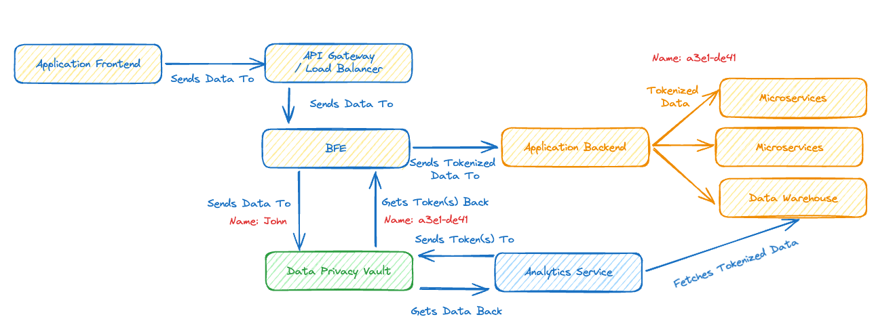

# The Challenge - Building Your Own Data Privacy Vault

For this challenge we’re going to build a service that can function as a Data Privacy Vault, that’s the green bit in the high-level diagram below that conceptually shows where it would fit in some sort of production system.



Our service will provide a HTTP based API that can be used to send sensitive data to be stored in the vault, receiving back a token that can later be used to retrieve the sensitive data by an authorised user/service.

To understand why the Data Privacy Vault is preferable to just encrypting the data check out Wikipedia’s article on [Tokenization](https://en.wikipedia.org/wiki/Tokenization_(data_security)?utm_source=substack&utm_medium=email).

## Step 1

In this step your goal is to create a simple tokenisation service that can create tokens and return their value, for the moment storing the data in memory is fine.

Once this is done you should have two endpoints:

Endpoint: `/tokenize`

Method: POST

Request payload:
```
{
	"id": req-12345”,
	"data": {
		"field1": "value1",
		"field2": "value2",
		"fieldn": "valuen"
	}
}
```

Success response: HTTP Code 201

Payload:
```
{
	"id": req-12345”,
	"data": {
		"field1": "t6yh4f6",
		"field2": "gh67ned",
		"fieldn": "bnj7ytb"
	}
}
```

Don’t forget to create the appropriate error response codes.

Endpoint: `/detokenize`

Method: POST

Request payload:

```
{
	"id": req-33445”,
	"data": {
		"field1": "t6yh4f6",
		"field2": "gh67ned",
		"field3": "invalid token"
	}
}
```

Response:

```
"id": req-33445”,
"data": {
    "field1": {
        "found": true,
        "value": "value1"
    },
    "field2": {
        "found": true,
        "value": "value2"
    },
    "fieldn": {
        "found": false,
        "value": ""
    }
}
```
Don’t forget to create the appropriate error response codes and to handle a token not being found.

## Step 2
In this step your goal is to store the data in a persistent store. All data should be stored encrypted. You could use something like Redis for this (and you could even build your own Redis). Be sure to pick an encryption algorithm that is suitably secure for privacy related data.

For some services the use of a format-preserving encryption algorithm will make it easier to drop a Privacy Data Vault into an existing solution. As the name suggests, this type of encryption keeps the format (and length) of the data. For example, consider a phone number, if the original number is +44 7974 314 455, then the encrypted data would retain the format but the value, will change to something like: +12 4325 465 432.

## Step 3
In this step your goal is to support authenticated access to the data in the vault. Think about service to service authentication and that the reader might not be the same as the writer.

Add some support for verifying that the caller is allowed to create tokens and refusing requests to create them without the correct permissions.

Add support for verifying that the caller is allowed to detokenize, returning a suitable error if they are not.

N.B. Don’t forget that when deployed to production communication with the Privacy Data Vault should be using HTTPS.

## Going Further
This is been an introduction to Data Privacy Vaults. To build out a more complete solution you can:

Allow a format to be specified for the data payload(s) to be tokenized.

Extend the authentication to integrate with common identify and access management solutions.

Integrate with a key management system to keep the cryptographic keys secure.

Provide alternative ways of calling the service, perhaps websockets or gRPC.

Creating a deployable service.

Turn it into a business - for example there are several Data Privacy Vaults available as commercial products in the AWS marketplace.